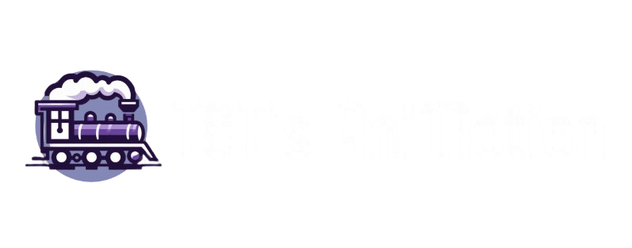

# 🎬 T&T's AniMotion

A modern anime streaming website featuring a sleek glassmorphism design and intuitive user experience.



---

## 📖 Table of Contents

- [About](#about)
- [Features](#features)
- [Tech Stack](#tech-stack)
- [Pages](#pages)
- [Installation](#installation)
- [Usage](#usage)
- [Design System](#design-system)
- [Project Structure](#project-structure)
- [Contributors](#contributors)
- [License](#license)

---

## 🎯 About

T&T's AniMotion is a frontend anime streaming platform designed to provide users with a modern, visually appealing interface for browsing anime series and movies. Built with pure HTML, CSS, and JavaScript, this project showcases a complete UI/UX redesign featuring glassmorphism effects and a purple gradient theme.

---

## ✨ Features

### 🎨 Modern Design
- **Glassmorphism UI** - Beautiful frosted glass effects throughout
- **Purple Gradient Theme** - Cohesive color scheme (#8b5cf6 & #ec4899)
- **Smooth Animations** - Hover effects, transitions, and micro-interactions
- **Responsive Design** - Fully optimized for mobile, tablet, and desktop

### 🧭 Navigation
- **Reusable Component** - Single navbar component used across all pages
- **Sidebar Menu** - Easy access to all main pages
- **Active Page Highlighting** - Automatic detection of current page
- **Smart Account Dropdown** - Quick access to account settings and logout

### 📺 Content Showcase
- **Auto-Advancing Banner** - 5-slide hero carousel with featured anime
- **Grid Layouts** - Clean 4-column card displays for series and movies
- **Category Sections** - New Episodes, Most Watched, Popular, and Genres
- **Hover Previews** - Play button overlays on card hover

### 📱 User Experience
- **Quick Access Login** - Simplified login page with guest access
- **Contact Form** - Integrated Formspree for user feedback
- **Pagination** - Easy navigation through content
- **Scroll to Top** - Convenient button for quick navigation

---

## 🛠️ Tech Stack

- **HTML5** - Semantic markup
- **CSS3** - Modern styling with flexbox and grid
- **JavaScript (ES6+)** - Vanilla JS for interactivity
- **Google Fonts** - Poppins font family
- **Font Awesome** - Icon library
- **Bootstrap Icons** - Additional icons
- **Formspree** - Contact form backend

---

## 📄 Pages

### 🏠 Home (`index.html`)
The main landing page featuring:
- Hero banner slider with 5 featured anime
- New Episodes section
- Most Watched Anime showcase
- Popular Anime grid
- Popular Genres display

### 🔐 Login (`index-login.html`)
Simplified login page with:
- Quick login button
- Guest access option
- Sign up link

### 📺 Series (`series.html`)
Browse anime series with:
- 4-column grid layout
- 16 anime series cards
- Popular sidebar
- Pagination controls

### 🎬 Movies (`movies.html`)
Browse anime movies with:
- 4-column grid layout
- 16 anime movie cards
- Recent sidebar
- Pagination controls

### 📧 Contact (`contact.html`)
Get in touch with:
- Contact form (Name, Email, Subject, Message)
- Formspree integration
- Success popup notification

---

## 🚀 Installation

1. **Clone the repository**
```bash
   git clone https://github.com/yourusername/animotion.git
   cd animotion
```

2. **Open in browser**
```bash
   # Simply open index.html in your preferred browser
   # Or use a local server (recommended)
```

3. **Using Live Server (VS Code)**
   - Install Live Server extension
   - Right-click `index.html`
   - Select "Open with Live Server"

---

## 💻 Usage

### Navigation
- Click the **hamburger menu** (☰) to open the sidebar
- Navigate between pages: Home, Series, Movies, Contact Us
- Access your account via the **profile icon** in the header

### Browsing Content
- Use the **hero banner arrows** to browse featured anime
- Hover over **anime cards** to see the play button
- Click **pagination buttons** to view more content

### Contact Form
- Fill in all required fields (marked with *)
- Click **Send Message** to submit
- Wait for the success popup confirmation

---

## 🎨 Design System

### Color Palette
```css
--primary-purple: #8b5cf6;
--accent-pink: #ec4899;
--dark-purple: #6d28d9;
--light-purple: #a78bfa;
--text-light: #ffffff;
--text-gray: #9ca3af;
--glass-bg: rgba(255, 255, 255, 0.05);
--glass-border: rgba(255, 255, 255, 0.1);
```

### Typography
- **Font Family**: Poppins
- **Base Size**: 62.5% (1rem = 10px)
- **Headings**: 2.5rem - 4.5rem
- **Body Text**: 1.4rem - 1.6rem

### Spacing
- **Container Padding**: 3% - 5%
- **Card Gaps**: 2rem - 3rem
- **Section Margins**: 4rem - 10rem

### Effects
- **Glassmorphism**: `backdrop-filter: blur(20px)`
- **Border Radius**: 1rem - 2rem
- **Transitions**: 0.3s ease
- **Hover Scale**: translateY(-1rem) or scale(1.1)

---

## 📁 Project Structure
```
animotion/
├── index.html              # Home page
├── index-login.html        # Login page
├── series.html             # Series page
├── movies.html             # Movies page
├── contact.html            # Contact page
├── account.html            # Account page
├── css/
│   ├── style.css           # Main styles
│   ├── series.css          # Series/Movies grid styles
│   └── form.css            # Contact form styles
├── js/
│   ├── navbar.js           # Reusable navigation component
│   ├── main.js             # Main functionality
│   └── series.js           # Series/Movies page logic
├── img/                    # Image assets
│   ├── animotionhdr1.png   # Logo
│   ├── main.gif            # Anime images
│   └── ...
└── README.md               # This file
```

---

## 👥 Contributors

<table>
  <tr>
    <td align="center">
      <a href="https://github.com/yourusername">
        <br />
        <sub><b>Thomas Joseph Almorin</b></sub>
      </a><br />
      <sub>Developer</sub>
    </td>
    <td align="center">
      <a href="https://github.com/partnerusername">
        <br />
        <sub><b>Trisha Mae Dumagsa</b></sub>
      </a><br />
      <sub>Developer</sub>
    </td>
  </tr>
</table>

---

## 🎓 Academic Project

This project was created as part of our web development coursework, demonstrating:
- Modern frontend development practices
- Responsive web design principles
- Component-based architecture
- User experience design
- Clean code organization

---

## 📝 License

This project is licensed under the MIT License - see the [LICENSE](LICENSE) file for details.

---

## 🙏 Acknowledgments

- **Font Awesome** - For the icon library
- **Bootstrap Icons** - For additional icons
- **Google Fonts** - For the Poppins font
- **Formspree** - For contact form handling
- Anime images and content used for educational purposes only

---

## 📞 Contact

**T&T's AniMotion Team**
- Thomas Joseph Almorin - [GitHub](https://github.com/yourusername)
- Trisha Mae Dumagsa - [GitHub](https://github.com/partnerusername)

Project Link: [https://github.com/yourusername/animotion](https://github.com/yourusername/animotion)

---

<p align="center">Made with 💜 by T&T</p>
<p align="center">© 2024 T&T's AniMotion. All Rights Reserved.</p>
